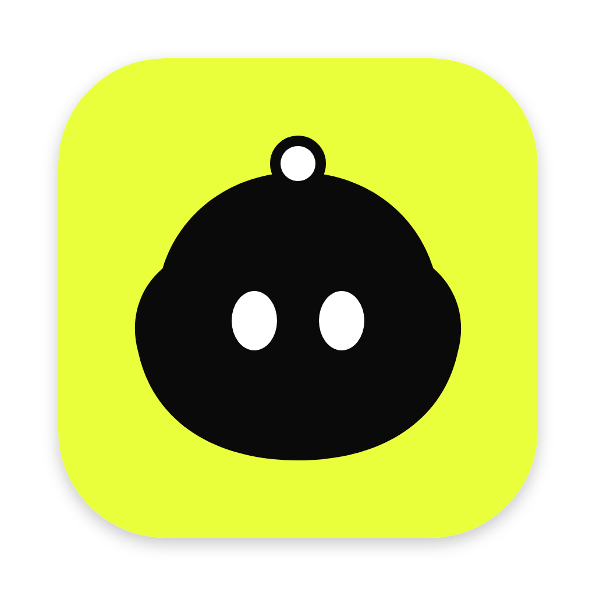
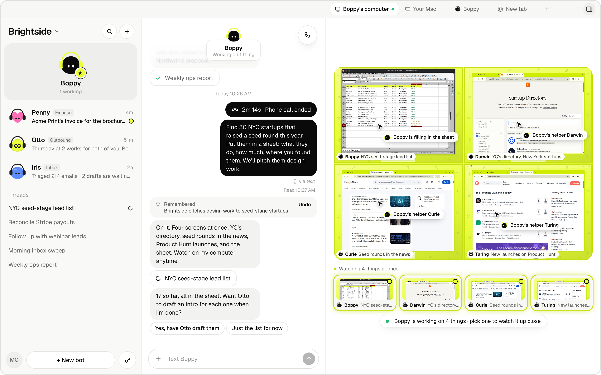
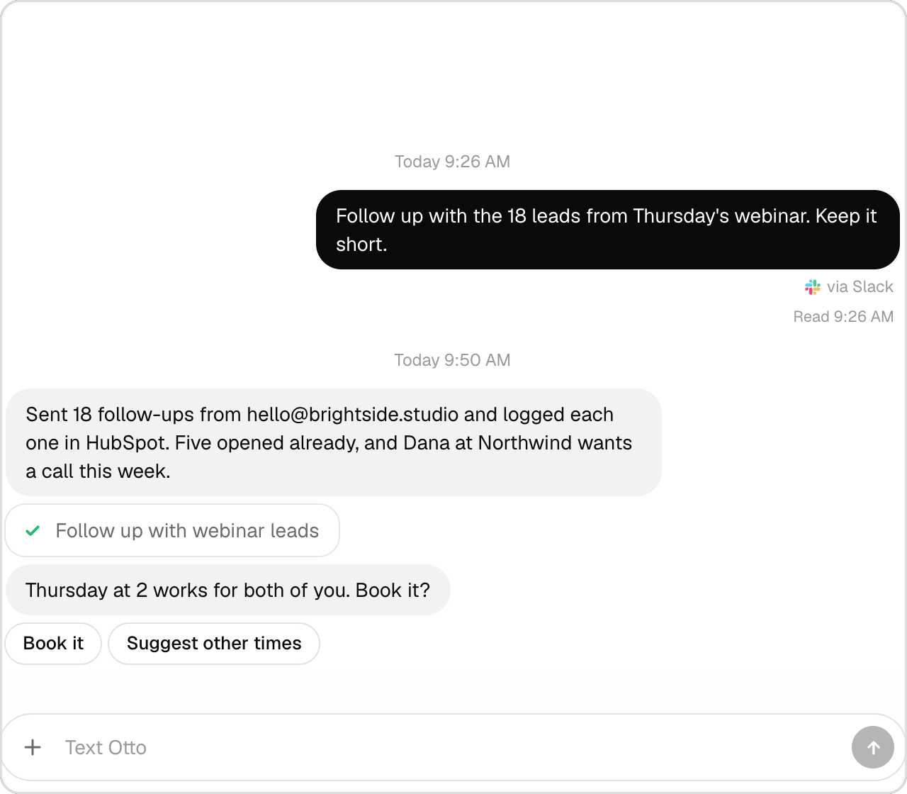

<p align="center">
  <a href="https://bops.bot"></a>
</p>

<h1 align="center">Bops</h1>

<p align="center">
  <b>Business ops, run by bots.</b><br>
  A team of AI bots that works for you on real computers. Chat with them like teammates, and they get the work done.
</p>

<p align="center">
  <a href="https://bops.bot/download/Bops.dmg"><b>Download for Mac</b></a>
  &nbsp;·&nbsp;
  <a href="https://bops.bot">Website</a>
  &nbsp;·&nbsp;
  <a href="#plans">Plans</a>
  &nbsp;·&nbsp;
  <a href="#run-it-yourself">Self-host</a>
</p>

<p align="center">
  <a href="https://bops.bot"></a>
  <a href="LICENSE"></a>
</p>

<p align="center">
  <a href="https://github.com/nickvasilescu"></a><br>
  <b>Created by <a href="https://github.com/nickvasilescu">Nick Vasilescu</a></b> (<a href="https://github.com/nickvasilescu">@nickvasilescu</a>)<br>
  Developed with <a href="https://orgo.ai">Orgo</a>
</p>

<br>

Bops is a Mac app that gives you a team of AI bots for your business ops: inbox, pipeline, invoices, reports. They work on cloud computers you can watch live and take over at any time. Reach them in the app and in Slack, Telegram and Discord, and on Pro and Max by text, call or email. They remember who you are and what they did yesterday.

<p align="center">
  
</p>

<table>
  <tr>
    <td width="50%" valign="top">
      
      <p><b>Watch or take over.</b> Watch any screen live, take control, then hand it back.</p>
    </td>
    <td width="50%" valign="top">
      
      <p><b>Asks before it acts.</b> Reading runs at once. Sending, creating and paying wait for your OK.</p>
    </td>
  </tr>
  <tr>
    <td width="50%" valign="top">
      
      <p><b>Your apps, your rules.</b> About 1,400 apps, several accounts each. Each bot gets only the access you give it.</p>
    </td>
    <td width="50%" valign="top">
      
      <p><b>Where your team works.</b> Ask in Slack, Telegram or Discord, and the answer comes back there.</p>
    </td>
  </tr>
</table>

## What your bots can do

- **Work on real computers.** Your bots work on a cloud computer from [Orgo](https://orgo.ai): 4 cores, 16 GB RAM and 4 screens, with Chrome, LibreOffice, GIMP and Inkscape. Watch any screen live, or take over. On Free and Pro all your bots share one computer. Max gives you up to 3.
- **Work as a team.** A main bot (Boppy, unless you rename it) runs the team and hands work to the specialists you add. Bots talk to each other, keep threads and report back in the chat. Each workspace is its own team.
- **Remember.** What you tell your bots, they remember, per workspace, on every channel.
- **Use your apps.** Connect Gmail, Calendar and any of about 1,400 apps, with several accounts each. Reading runs at once. Sending, creating or paying asks you first. A bot set to Just do it sends and changes things without asking, and still asks before paying.
- **Look things up.** Companies, people, work emails (checked before they're used), phones, company news, hiring and funding, and local businesses, for cents a lookup. A pricier lookup asks you first, and so does emailing someone a bot found, even on Just do it.
- **Answer email.** On Pro and Max, your main bot has its own email address, ending in bops.bot. Email it a task, and it emails back when it's done.
- **Take texts and calls.** On Pro and Max, your main bot has its own phone number. Text it like a person, or call it and talk live. It hands off work while you talk, and texts you the results. Only you can give it work: anyone else who calls gets a bot that takes a message.
- **Talk in the app.** Call any bot by voice, or use the mic in the chat.
- **Join your team's chat.** Add a bot to Slack, Telegram or Discord. It answers when it's mentioned and takes requests only from you.
- **Work on your Mac, too.** A bot can do a task on your Mac in a Chrome of its own, so sites see your home connection. It can't touch your files or apps there until you turn on Full access in **Settings → This Mac**, which also gives its tasks a shell.
- **Sign in safely.** Logins live in the Vault: passwords and 2FA keys stay in your Mac's Keychain, and no model ever sees them.
- **Keep an eye on things.** Routines and reminders run on a schedule. A bot can watch a screen, like an inbox or a dashboard, and tell you when something there needs you.
- **Make things.** Bots draw and edit pictures right in the chat, and files they link open in Bops.

Bops runs on your Mac: keep it on for routines, watches, and Telegram or Discord. While it's away, callers to your bot's number get a bot that takes a message.

Coming soon: WhatsApp, and a real phone for each bot that it drives like its computer.

## Plans

Every plan includes a Bops computer: 1 on Free and Pro, up to 3 on Max. On Free and Pro, all your bots share that one computer. AI credit pays for what your bots do, billed at cost.

| | **Free** | **Pro** | **Max** |
|---|---|---|---|
| Price | $0 | $20 a month | $200 a month |
| Computers | **1 computer included**<br>10 hours a month, 4 cores, 16 GB RAM, multi-screen | **1 computer included**<br>Always on, 4 cores, 16 GB RAM, templates, multi-screen | **Up to 3 computers**<br>Always on, 4 cores, 16 GB RAM each |
| AI credit | $5 of AI credit, once | $20 of AI credit every month | $200 of AI credit every month |
| Bots | As many as you like, all sharing that one computer | As many as you like, all sharing that one computer | As many as you like, across up to 3 computers |
| Phone numbers and emails | No phone number or email | 1 phone number and 1 email | Up to 5 phone numbers and 5 emails |

- Free's computer gets 10 hours a month. It sleeps when nobody is using it, so the hours last. Account and usage shows the hours used this month and when they start over.
- Need more AI credit? Add some any time, $5 to $1,000, in Account and usage. It's a one-time charge, never automatic.
- Pro and Max credit doesn't carry over from month to month. When credit runs out, tasks stop cleanly.
- Pick or change a plan in the app, in Account and usage.

Running Bops yourself on your own keys? Bops plans don't apply: you pay each provider directly, and your Orgo plan sets how many computers you can run. See [Run it yourself](#run-it-yourself).

## Download

<p>
  <a href="https://bops.bot/download/Bops.dmg"></a>
</p>

1. Download Bops from [bops.bot](https://bops.bot). It runs on a Mac with Apple silicon.
2. Open the DMG and drag Bops to Applications.
3. Sign in with Google, with your email, or with Orgo. If you don't have an Orgo account yet, one is made for you.
4. Say hi to Boppy. It takes it from there.

Every release is signed with Developer ID and notarized by Apple. When a newer version is out, Bops tells you, along with what's new in it.

## Credits

Bops was created by [Nick Vasilescu](https://github.com/nickvasilescu) ([@nickvasilescu](https://github.com/nickvasilescu)). It started as his open-source project and is now developed with [Orgo](https://orgo.ai). See [AUTHORS](AUTHORS) and [CITATION.cff](CITATION.cff).

Thanks to everyone who has reported a bug, sent a fix or shared an idea: see [all contributors](../../graphs/contributors).

## Built with

- [Orgo](https://orgo.ai): the bots' cloud computers
- [OpenAI](https://openai.com): chat, tasks and voice
- [Honcho](https://honcho.dev): long-term memory
- [Composio](https://composio.dev): connected apps
- [treg](https://treg.to): business data
- [AgentMail](https://agentmail.to): the bots' email
- [AgentPhone](https://agentphone.ai): phone numbers, texts and calls
- [TypeSafe](https://typesafe.ai): small yes or no judgments

The app itself is Electron and Next.js.

---

## How it works

- **The app** (`desktop/`, Electron) starts the **Bops server** (Next.js: `app/` and `lib/server/`) on your Mac, on port 3210. The server runs the team: chats, threads, routines, watches and the bots' tasks.
- **The bots' computers** are Orgo cloud computers, launched from a template built from this repo (`orgo/`, with what runs on them in `vm/`).
- **Tasks on the bots' computers** run on OpenAI's computer tool (Responses API). **Tasks on your Mac** run on OpenAI's Agents API, with the Codex CLI (`codex exec-server`) and a Chrome of the bots' own.
- **Signed in with Orgo**, the app works through Bops Cloud (`cloud/`), the server Orgo runs for hosted Bops. Orgo's provider keys stay there, and your Mac gets only narrow ones: a key for your own mailboxes and a spend-capped key for tasks. Bops Cloud also takes the webhooks for texts, calls and Slack, and keeps your chats in your account.
- **Self-hosted** (`BOPS_SELF_HOSTED=1`), the app calls each provider directly with the keys in `.env.local` and keeps its state in `.data/` on your Mac. A small relay (`edge/`) can give the webhooks a public HTTPS address.

## Run it yourself

### Requirements

- A Mac with Apple silicon, and Node 22 or newer.
- **Required:** an [Orgo](https://orgo.ai) account and an OpenAI API key, plus a second, restricted OpenAI key with a spend limit for tasks (`OPENAI_EXECUTOR_API_KEY`).
- **Recommended:** TypeSafe (small judgment calls), Honcho (memory), Composio (apps), treg (business data), AgentMail (email), Tailscale (a direct live view of the bots' screens).
- **Optional:** AgentPhone and a public URL, for texts and calls.
- **For tasks on your Mac:** Google Chrome. Bops uses your Codex CLI if you have one, or installs it, and never runs it on your ChatGPT account.

### Start it

```bash
npm run setup                # dependencies, .env.local from .env.example, and a git hook (scripts/setup.sh)
npm run app                  # opens the app, which starts the server on port 3210
```

In `.env.local`, fill in at least `OPENAI_API_KEY` and `OPENAI_EXECUTOR_API_KEY`, and `ORGO_API_KEY` to skip signing in. Or set `BOPS_SELF_HOSTED=0` and sign in with Orgo: Bops Cloud then calls the providers, and you need no keys of your own. Run `npm run setup` again any time; it only adds what's missing.

Or run the server alone with `npx next dev --port 3210 -H 127.0.0.1` and open http://127.0.0.1:3210. Leave out `-H 127.0.0.1` only when `edge/` or the bots' computers must reach it over your tailnet.

The app opens on sign-in: **Continue with Google**, **Continue with email** or **Sign in with Orgo**. With `BOPS_SELF_HOSTED=1` and `ORGO_API_KEY` set, it skips this and uses your key. Then open **Settings → You** and add your name and a line about yourself: every bot uses it.

### Settings

`.env.example` lists every setting with a note on each. The ones that matter most:

| Setting | What it's for |
|---|---|
| `BOPS_SELF_HOSTED=1` | Call each provider directly with your own keys, and show the Self-hosting section in Settings. On in `.env.example`. |
| `OPENAI_API_KEY` | Chat, calls, and tasks on the bots' computers. Required. |
| `OPENAI_EXECUTOR_API_KEY` | The key Codex runs the bots' tools with: tasks on your Mac, and tasks on their computers with `BOPS_COMPUTER_TOOL=0`, which copies it onto each computer. Use a restricted key with a spend limit; it can be in the same OpenAI project. Required. |
| `ORGO_API_KEY` | The bots' cloud computers. Optional: set it to skip signing in with Orgo. |
| `TYPESAFE_API_KEY` | Small yes or no judgments: is this risky, which bot should take it. |
| `HONCHO_API_KEY` | Long-term memory. |
| `COMPOSIO_API_KEY` | Connected apps. |
| `TREG_TOKEN` | Business data. |
| `AGENTMAIL_API_KEY`, `BOPS_MAIL_DOMAIN` | The bots' email, on a domain you've verified in AgentMail. |
| `TAILSCALE_AUTH_KEY` | Lets the bots' computers join your tailnet for a direct, private live view. |
| `AGENTPHONE_*`, `BOPS_AGENTPHONE_HOOK_URL` | Phone numbers, texts and calls. See [Texts and calls](#texts-and-calls). |
| `TWILIO_VERIFY_SERVICE_SID`, `TWILIO_API_KEY_SID`, `TWILIO_API_KEY_SECRET` | Sends a code that proves a mobile number or email address is yours. |
| `BOPS_PUBLIC_URL` | Your relay's public address (`edge/`): where people land after connecting an app, OAuth callbacks, and the bots' pictures. |
| `BOPS_SLACK_*` | Your own Slack app. `slack/setup.mjs` makes it and fills these. Set `BOPS_PUBLIC_URL` first, and change the OAuth redirect in `slack/manifest.json` from `api.bops.bot` to your relay. Without them, Slack goes through Composio's app. |

Telegram and Discord need no settings: you paste each bot's token in the app, and it's kept in the Keychain.

### The bots' computers

Bot computers launch from an Orgo template built from this repo. By default they use Orgo's public copy, which every account has. To build your own, run `node orgo/bops-base.mjs publish` and set `BOPS_ORGO_TEMPLATE` to its ref.

Bops keeps its computers in one Orgo workspace: the signed-in user's workspace named "bops", or `BOPS_ORGO_WORKSPACE` when self-hosting on `ORGO_API_KEY`. It never creates or deletes computers outside it.

### Texts and calls

Optional, for self-hosting:

1. Deploy `edge/`, a small relay that forwards webhooks to your Mac over Tailscale. `edge/fly.toml` has a config for Fly: set your own app name in it. The relay needs a Tailscale login and `BOPS_UPSTREAM`, your Mac's tailnet address on port 3210.
2. Point your AgentPhone webhook at `/hooks/agentphone` on the relay. Texts and calls both arrive there.
3. Set the `AGENTPHONE_*` settings and `BOPS_AGENTPHONE_HOOK_URL`, then add your mobile in **Settings → How your bots reach you**.

The relay also takes `/hooks/slack` for your own Slack app, and `/hooks/openai` for a number you route to an OpenAI SIP trunk yourself (with `OPENAI_WEBHOOK_SECRET`). Every webhook is signature-checked. US texting needs an A2P 10DLC registration for your brand.

The packaged app's server listens on 127.0.0.1 only. To let webhooks reach it over the tailnet, add `BOPS_LISTEN_ALL=1` to `~/Library/Application Support/Bops/.env.local`. Other addresses can then reach only the webhook paths and the bots' computers' calls, each of which proves itself.

## Releasing the Mac app

```bash
scripts/release.sh          # or: npm run app:release
```

It fetches the relay agent, builds the server (Next.js standalone), packs it into Bops.app with its own Node, and makes `dist-desktop/Bops-<version>-arm64.dmg` and `.zip`. Before it finishes, it starts the bundled server as a fresh install would and checks that it answers. The installed app keeps its local files (and, self-hosted, its state) in `~/Library/Application Support/Bops/server/.data`, and its log in `~/Library/Logs/Bops/server.log`.

A release needs:

- **The relay agent** that routes the bots' Chrome through your Mac (Route through this Mac). `scripts/fetch-relay.sh` downloads it from a private Orgo repository, so a release build needs that access. Without it, `release.sh` stops.
- **A Developer ID Application certificate**, in the keychain or as `CSC_LINK` plus `CSC_KEY_PASSWORD` (`CSC_NAME` picks one when there are several). An Apple Development certificate is not enough. Without one, the script builds an unsigned app for testing on your own Mac.
- **Notarization credentials:** an App Store Connect API key (`APPLE_API_KEY`, `APPLE_API_KEY_ID`, `APPLE_API_ISSUER`), or an Apple ID (`APPLE_ID`, `APPLE_APP_SPECIFIC_PASSWORD`, `APPLE_TEAM_ID`).

To try your changes in the app, run `npm run app:build`. It makes an unsigned development app that runs `next dev` from this folder. `npm run app:install` builds the same app, then deletes `/Applications/Bops.app` and puts this one in its place.

Orgo's releases are built from a version tag of this repository by a workflow in Orgo's private repository, which holds the signing and notarization secrets. It builds, signs and notarizes on a GitHub Mac, checks that Gatekeeper accepts the app, and attaches the DMG and zip to the release here with that version's notes from `docs/releases/`. This repository holds no secrets.

The app runs with the hardened runtime and three entitlements (`build/entitlements.mac.plist`): JIT for Electron, the microphone for calls, and Apple Events so Full access can use your apps. Bops asks macOS for Screen Recording, the microphone and notifications, and Full access also needs Full Disk Access and Automation. Bops isn't on the Mac App Store because its sandbox would stop Bops from running its own server, starting Codex and Chrome for the bots, and driving other apps.

## Project layout

| Path | What's there |
|---|---|
| `app/` | Next.js routes: the UI and `app/api/*` |
| `components/app/` | The app's UI. `components/message-ui/` is the chat kit. |
| `lib/server/` | Everything server-side: chat engine, sessions, providers, state |
| `lib/plan-includes.ts` | What each plan includes, in the words the app and bops.bot show |
| `desktop/` | The Electron shell |
| `vm/` | What runs on the bots' computers: screen MCP, browser helpers |
| `orgo/` | The Orgo template builder |
| `cloud/` | Bops Cloud, the server for hosted Bops |
| `db/` | The Postgres schema for hosted Bops |
| `edge/` | The webhook relay for self-hosting |
| `slack/` | Bops' own Slack app |
| `site/` | bops.bot |
| `docs/` | How Bops builds on Orgo. `docs/releases/` has what's new in each version. |

## Contributing

Bug reports and pull requests are welcome. For anything bigger than a small fix, open an issue first so we can agree on the approach. Read [CONTRIBUTING.md](CONTRIBUTING.md), which covers the CLA, and the [Code of Conduct](CODE_OF_CONDUCT.md).

Before you open a pull request:

```bash
npx next typegen        # route types (next-env.d.ts isn't committed)
npx tsc --noEmit -p .
npm run lint
```

## Privacy

Signed in with Orgo, Bops sends Orgo usage events through PostHog, the analytics service orgo.ai uses: the app opening, a bot being made, a message sent or a task finished (counted, never read), a plan changing, and errors in Bops' own code (the error's type and where in Bops' code it happened, never its message). They are tied to your Orgo account and never include what you or your bots write, say or see: no messages, emails, files, contacts, phone numbers, web addresses, screens or keys. Like orgo.ai, the app's window also sends device details: OS, screen size, time zone, a device id and approximate location from your IP. Bops doesn't record your screen or your sessions. Turn it off for all your Macs in **Settings → You → Share usage data**, or on one Mac with `BOPS_TELEMETRY=0` or `DO_NOT_TRACK=1` in `~/Library/Application Support/Bops/.env.local`. The one-Mac setting stops what that Mac sends and what Bops Cloud sends for it; account events Bops Cloud sees on its own (AI credit running out, a plan changing, a number your plan set up) stop only with the Settings switch. Self-hosted (`BOPS_SELF_HOSTED=1`), Bops sends nothing. Every event and property is listed in [`cloud/analytics-rules.ts`](cloud/analytics-rules.ts). See Orgo's [Privacy Policy](https://www.orgo.ai/privacy) and [subprocessors](https://www.orgo.ai/subprocessors).

## Security

- The Bops server trusts requests from your Mac. Don't expose port 3210 to the internet.
- The packaged app's server listens on 127.0.0.1 only. With `BOPS_LISTEN_ALL=1`, or in development (`npm run app`, or `next dev` without `-H 127.0.0.1`), other devices on your network can reach it: keep that network to your own devices.
- Signed in with Orgo, provider keys stay on Bops Cloud and webhooks come in through it. Self-hosted, keys live in `.env.local` and webhooks go public through `edge/`, each one signature-checked.
- Saved logins live in the Mac's Keychain. Neither keys nor logins are sent to the browser or to a model.
- Codex runs the bots' tools on `OPENAI_EXECUTOR_API_KEY`, and with `BOPS_COMPUTER_TOOL=0` it's copied onto their computers. Give it a spend limit.
- Found a vulnerability? Report it privately, as [SECURITY.md](SECURITY.md) describes, not in a public issue.

## License

Bops is under the [Functional Source License, Version 1.1, ALv2 Future License](LICENSE) (FSL-1.1-ALv2), a [Fair Source](https://fsl.software) license. In plain words (the [LICENSE](LICENSE) has the exact terms):

- **Use it for anything but competing with it.** You may use, copy, change and share Bops at work or at home: inside your company, for teaching and research, and in services you provide to people who use Bops under these terms.
- **Don't offer it as a competing product.** You may not make Bops available to others in a commercial product or service that replaces Bops (or one of our products built with it), or that does substantially the same thing, such as a hosted Bops.
- **Each version becomes Apache 2.0.** Two years after we release a version, that version is also yours under the Apache License 2.0, with no limit on competing.

"Bops", the Bops logo and the bot mascots are trademarks of Organic Intelligence, Inc. The license covers the code, not the name or logo. See [TRADEMARK.md](TRADEMARK.md).
